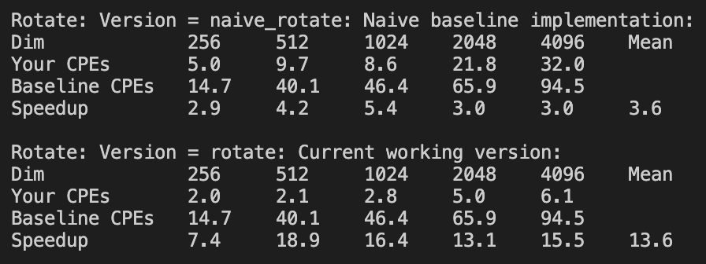

## 环境

CPU：Intel(R) Core(TM) i5-10400 CPU @ 2.90GHz

Cache Size：12288 KB

cpu cores       : 6


## Rotate

```C
for (i = 0; i < dim; i++)
    for (j = 0; j < dim; j++)
        dst[RIDX(dim - 1 - j, i, dim)] = src[RIDX(i, j, dim)];
```

以上代码从一个数组中读出数据，然后将其赋值到另外一个数组的一个位置中。通过对其分析，并不能使用memcpy的方式直接批量复制内存（哪怕是先批量复制内存再一个个转移），但是考虑到其每次循环都会算一次dim-1-j，所以可以交换i和j，达到很不错的优化效果：

```c
for (j = 0; j < dim; j++) {
    for (i = 0; i < dim; i++) {
        dst[RIDX(dim - 1 - j, i, dim)] = src[RIDX(i, j, dim)];
    }
}
```


考虑使用并行的方式加速这个内存拷贝过程，常见的并行方式包括多进程、多线程。多进程的方式在这里会因为不同进程的内存无法共享导致需要额外的通讯，降低了效率，所以使用多线程的方式效果更好，但是使用多线程的方式需要使用额外的编译指令，如pthread_t需要-pthread，openmp需要-fopenmp。但是openmp的加速效果非常好（NUM_THREADS = ==6==）：


以block的方式去写效率会更高：

```C
void rotate(int dim, pixel *src, pixel *dst) {
    int i, j, k, l;
    int block_size = 32;

    for (i = 0; i < dim; i += block_size) {
        for (j = 0; j < dim; j += block_size) {
            int x_end = i+block_size;
            int y_end = j+block_size;
            for (k = i; k < x_end; k++) {
                for (l = j; l < y_end; l++) {
                    dst[RIDX(dim - 1 - k, l, dim)] = src[RIDX(l, k, dim)];
                }
            }
        }
    }
}
```

block_size=2


block_size=4


Block_size=8


Block_size=16


Block_size=32



结合openmp：


## Smooth

将4个顶点和4条边先单独算，然后再算中间的，中间的可以取消一次判断：

```C
static pixel avg_mid(int dim, int i, int j, pixel *src) {
    int ii, jj;
    pixel_sum sum;
    pixel current_pixel;

    initialize_pixel_sum(&sum);
    for (ii = i - 1; ii <= i + 1; ii++)
        for (jj = j - 1; jj <= j + 1; jj++)
            accumulate_sum(&sum, src[RIDX(ii, jj, dim)]);

    assign_sum_to_pixel(&current_pixel, sum);
    return current_pixel;
}

void smooth(int dim, pixel *src, pixel *dst) { 
    int i, j;

    // 四个角
    dst[RIDX(0, 0, dim)] = avg(dim, 0, 0, src);
    dst[RIDX(dim-1, 0, dim)] = avg(dim, dim-1, 0, src);
    dst[RIDX(0, dim-1, dim)] = avg(dim, 0, dim-1, src);
    dst[RIDX(dim-1, dim-1, dim)] = avg(dim, dim-1, dim-1, src);

    // 四条边
    for (i = 1; i < dim-1; i++) {
        dst[RIDX(0, i, dim)] = avg(dim, 0, i, src);
        dst[RIDX(i, 0, dim)] = avg(dim, i, 0, src);
        dst[RIDX(dim-1, i, dim)] = avg(dim, dim-1, i, src);
        dst[RIDX(i, dim-1, dim)] = avg(dim, i, dim-1, src);
    }

    

    // 矩阵卷积
    for (i = 1; i < dim-1; i++)
        for (j = 1; j < dim-1; j++)
            dst[RIDX(i, j, dim)] = avg_mid(dim, i, j, src);
}
```

可以加速一倍：


循环展开之后，效果可以达到近4倍：

```C
static pixel avg_mid(int dim, int i, int j, pixel *src) {
    pixel_sum sum;
    pixel current_pixel;

    initialize_pixel_sum(&sum);

    accumulate_sum(&sum, src[RIDX(i, j-1, dim)]);
    accumulate_sum(&sum, src[RIDX(i, j, dim)]);
    accumulate_sum(&sum, src[RIDX(i, j+1, dim)]);

    accumulate_sum(&sum, src[RIDX(i-1, j-1, dim)]);
    accumulate_sum(&sum, src[RIDX(i-1, j, dim)]);
    accumulate_sum(&sum, src[RIDX(i-1, j+1, dim)]);

    accumulate_sum(&sum, src[RIDX(i+1, j-1, dim)]);
    accumulate_sum(&sum, src[RIDX(i+1, j, dim)]);
    accumulate_sum(&sum, src[RIDX(i+1, j+1, dim)]);

    assign_sum_to_pixel(&current_pixel, sum);
    return current_pixel;
}
```


矩阵卷积优化算法，思路是减少重复计算，

```C
static void accumulate_sum_without_num(pixel_sum *sum, pixel p) {
    sum->red += (int)p.red;
    sum->green += (int)p.green;
    sum->blue += (int)p.blue;
    return;
}

static void accumulate_pixel_sum_without_num(pixel_sum *sum, pixel_sum p) {
    sum->red += p.red;
    sum->green += p.green;
    sum->blue += p.blue;
    return;
}

static void assign_sum_to_pixel_default(pixel *current_pixel, pixel_sum sum) {
    current_pixel->red = (unsigned short)(sum.red / 9);
    current_pixel->green = (unsigned short)(sum.green / 9);
    current_pixel->blue = (unsigned short)(sum.blue / 9);
    return;
}

static pixel_sum avg3col(int dim, int i, int j, pixel *src) {
    pixel_sum sum;

    initialize_pixel_sum(&sum);

    accumulate_sum_without_num(&sum, src[RIDX(i, j-1, dim)]);
    accumulate_sum_without_num(&sum, src[RIDX(i, j, dim)]);
    accumulate_sum_without_num(&sum, src[RIDX(i, j+1, dim)]);

    // assign_sum_to_pixel(&current_pixel, sum);
    return sum;
}

static pixel avg3row(int dim, int i, int j, pixel_sum *src) {
    pixel_sum sum;
    pixel current_pixel;

    initialize_pixel_sum(&sum);

    accumulate_pixel_sum_without_num(&sum, src[RIDX(i-1, j, dim)]);
    accumulate_pixel_sum_without_num(&sum, src[RIDX(i, j, dim)]);
    accumulate_pixel_sum_without_num(&sum, src[RIDX(i+1, j, dim)]);

    assign_sum_to_pixel_default(&current_pixel, sum);
    return current_pixel;
}

void smooth(int dim, pixel *src, pixel *dst) { 
    int i, j;

    // 四个角
    dst[RIDX(0, 0, dim)] = avg(dim, 0, 0, src);
    dst[RIDX(dim-1, 0, dim)] = avg(dim, dim-1, 0, src);
    dst[RIDX(0, dim-1, dim)] = avg(dim, 0, dim-1, src);
    dst[RIDX(dim-1, dim-1, dim)] = avg(dim, dim-1, dim-1, src);

    // 四条边
    for (i = 1; i < dim-1; i++) {
        dst[RIDX(0, i, dim)] = avg(dim, 0, i, src);
        dst[RIDX(i, 0, dim)] = avg(dim, i, 0, src);
        dst[RIDX(dim-1, i, dim)] = avg(dim, dim-1, i, src);
        dst[RIDX(i, dim-1, dim)] = avg(dim, i, dim-1, src);
    }

    pixel_sum* temp = malloc(dim*dim*sizeof(pixel_sum));
    // 避免重复计算
    for (i = 0; i < dim; i++) {
        for (j = 1; j < dim-1; j++) {
            temp[RIDX(i, j, dim)] = avg3col(dim, i, j, src);
        }
    }

    // 矩阵卷积
    for (i = 1; i < dim-1; i++)
        for (j = 1; j < dim-1; j++)
            dst[RIDX(i, j, dim)] = avg3row(dim, i, j, temp);
}
```

效果反而不好，可能是中间循环多、过程复杂，开销反而更大：


